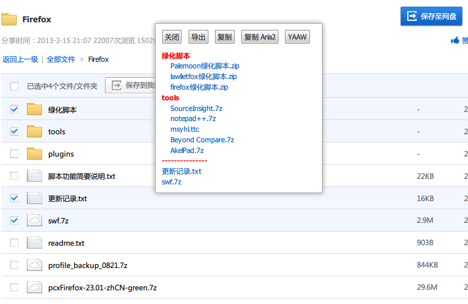

BaiduPanDownloadHelper
======================

批量导出百度盘的下载链接，支持2层目录，支持个人主页、分享文件夹或单文件、分享专辑页面、分享主页，支持复制到剪贴板、复制为 Aria2 格式、YAAW。

## 使用说明

支持Firefox（Greasemonkey/Scriptish）， Chrome（Tampermonkey）

非常感谢 [BaiduPanMD5Button](https://userscripts.org/scripts/show/156906)

 - **分享主页**：双击复制所有链接到剪贴板，可用 iDown 的 lua 脚本实现直接批量下载。
 	- TODO: iDown 文件下载的问题。TLF-MiniSD——史蒂芬·斯皮尔伯格 http://yun.baidu.com/s/1zMWXu
 - 勾选条目后，新增右键 “复制"、"复制 aria2" 菜单

Updates
-------

 - 2013-11-06，版本 3.0。大幅改进，新增个人主页、分享专辑页面的支持，分享主页双击复制所有链接，YAAW。
 - 2013-10-30，版本 2.9。添加 Aria2 参数，增加单文件下载。
 - 2013-10-29，[版本 2.8](http://userscripts.org/scripts/diff/162138/659078)。修正复制到剪贴板的问题。新增复制为 Aria2c 格式。
 - 2013-10-26，[版本 2.7](http://userscripts.org/scripts/diff/162138/656944)。修正首页单文件夹的问题。新增右键 "复制" 菜单。
 - 2013-10-22，[版本 2.6](http://userscripts.org/scripts/diff/162138/655451)。修正文件夹的判定。
 - 2013-10-09，版本 2.5，更改 @include
 - 2013-10-03，版本 2.4，增加 http\*://yun.baidu.com/share/link\* 包含链接
 - 2013-08-27，版本 2.2，调整下格式
 - 2013-08-27，版本 2.1，增加滚动条
 - 2013-07-22，版本 2.0，全部重写
 - 2013-06-05，版本 1.7，增加当前页面链接显示
 - 2013-06-01，版本 1.6，修复控制台错误
 - 2013-05-13，版本 1.5，修复当前无路径下的问题，修复复制到剪贴板的问题
 - 2013-05-10，版本 1.4，改成无弹窗版
 - 2013-04-09，版本 1.3，完善无文件夹下的获取，其它细微改进，感谢 rpzfirefoxgmjs 的反馈
 - 2013-04-01，版本 1.2.1，改进包含的网址，感谢 海峰无敌 的反馈
 - 2013-03-28，版本 1.2，增加 复制到剪贴板按钮，其它改进
 - 2013-03-17，版本 1.1，增加 导出链接（包括文件夹下） 按钮，完善脚本
 - 2013-03-16，版本 1.0，简易版本

Test
----

### 百度盘链接类型

主页

- [美剧集中营](http://yun.baidu.com/share/home?uk=4080204509&view=share#category/type=0)
- 主页（混杂文件夹、专辑、单文件）： http://yun.baidu.com/share/home?uk=53993635&view=share#category/type=0
- 自己主页：http://pan.baidu.com/disk/home
- 自己主页2：http://pan.baidu.com/disk/home#dir/path=%2FVideo

分享

- 文件夹：http://pan.baidu.com/share/link?shareid=146642&uk=2214641459#dir
- 文件夹2：http://pan.baidu.com/share/link?shareid=146642&uk=2214641459#dir/path=%2FVerycd%20Share
- 文件夹3：http://yun.baidu.com/s/1tbOFR
- 多文件：http://yun.baidu.com/share/link?uk=204960419&shareid=3088180530
- 单文件：http://yun.baidu.com/share/link?uk=204960419&shareid=2047818755
- 专辑（多文件）：http://yun.baidu.com/pcloud/album/info?uk=4080204509&album_id=2736249596228639739